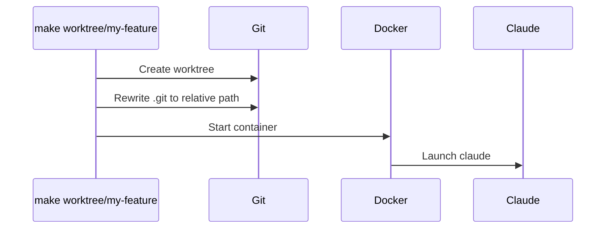

# Claude Code + Git Worktrees + Devcontainers

**Experimental.** Run Claude Code in isolated Docker containers with network restrictions. Each git worktree gets its own container.


## Setup

**Requirements:**
- Docker Desktop
- `npm install -g @devcontainers/cli`

**Environment:**
```bash
export GITHUB_TOKEN="ghp_..."  # Optional (for gh CLI)
```

**Authentication:**

First time: Claude prompts for login when you run `make worktree/branch` or `make claude`. Choose your authentication method and complete the flow.

Credentials are stored in a shared Docker volume (`claude-code-config`). All containers share authentication automatically.

## Usage

```bash
# Create worktree + container + launch Claude
make worktree/feature-name

# List all worktrees and containers
make list

# From any worktree or main branch
make claude    # Auto-creates container if needed
make dev       # Start container only
make down      # Stop container
```

## How It Works



**Structure:**
```
repo/
├── .git/
├── .devcontainer/       # Config + security scripts
├── Makefile
└── .worktrees/
    └── my-feature/      # Container: repo-name--my-feature
        └── .git         # Contains: gitdir: ../../.git/worktrees/my-feature
```

**Inside container:**
- Entire repo mounted at `/repo`
- Working directory: `/repo/.worktrees/my-feature`
- Network restricted to: api.anthropic.com, GitHub, npm
- Everything else blocked

## Environment Variables

| Variable | Required | Purpose |
|----------|----------|---------|
| `GITHUB_TOKEN` | No | GitHub CLI authentication |

## Troubleshooting

**Git fails inside container**
```bash
cat .git  # Should show: gitdir: ../../.git/worktrees/branch-name
```

**Wrong branch in Claude**
```bash
make list  # Verify container matches branch
```

**Container not starting**
```bash
docker ps -a  # Check container status
make dev      # Recreate container
```

## Technical Details

**Git worktrees:** `.git` file uses relative paths. Works on host and container without modification.

**Container naming:** `${REPO_NAME}--${BRANCH_NAME}`.

**Auto-start:** `make claude` creates container if missing. Uses `devcontainer exec` for auto-start of stopped containers.

**Security:** `init-firewall.sh` runs on container start. Uses iptables to whitelist domains. Blocks everything else including RFC1918 ranges.

## References

- [Claude Code Docs](https://docs.claude.com/en/docs/claude-code)
- [Dev Containers Spec](https://containers.dev/)
- [Git Worktrees](https://git-scm.com/docs/git-worktree)
